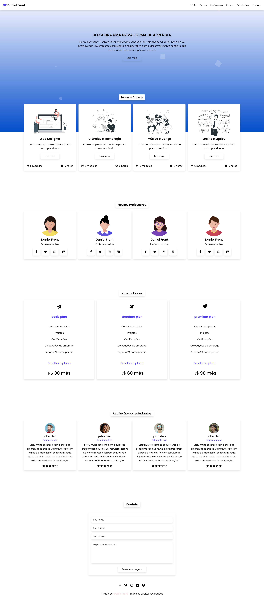

<b>Site de cursos com efeito gradiente</b>

&nbsp;
&nbsp;
&nbsp;

Esse projeto consiste em uma interface bem otimizada para os usuários. Desenvolvido com HTML5, CSS3 e JavaScript, o projeto é totalmente responsivo, garantindo uma boa navegação em todos os dispositivos.

<a href="https://sitedegradecurso.netlify.app/"><strong>Demonstração ao vivo</strong></a>

Estrutura HTML5:

Criação da estrutura HTML5 que inclui (header, section e divs)
Utilização de tags semânticas para uma estrutura clara e acessível.  

Estilização com CSS:

Utilização de CSS para estilizar site completo, utilizando variáveis para acelerar o processo de desenvolvimento, tornando-o visualmente atraente e alinhado com a identidade visual do projeto.
Implementação de media queries para ajustar o layout de acordo com a largura da tela, garantindo a responsividade.  

Navegação responsiva:

Implementação de uma navegação responsiva que se adapta às diferentes resoluções de tela.
Utilização de ícones ou outros elementos visuais para melhorar a usabilidade em dispositivos de toque.  

Compatibilidade com navegadores:

Testes em diferentes navegadores para garantir a compatibilidade e realizar ajustes se necessário.  

Responsividade e adaptação:

Verificação e ajustes para garantir que o layout se adapte de forma eficiente a telas de diversos tamanhos.
Testes em dispositivos móveis para assegurar uma experiência consistente.  

Otimização de código:

Otimização do código HTML e CSS para melhorar o desempenho e a eficiência de carregamento da página.  

Documentação:

Elaboração de documentação explicativa sobre a estrutura do código, a lógica de navegação e as instruções de uso.

 <b>Contato:</b>

Se você quiser entrar em contato comigo, sinta-se a vontade.
 

 
 
